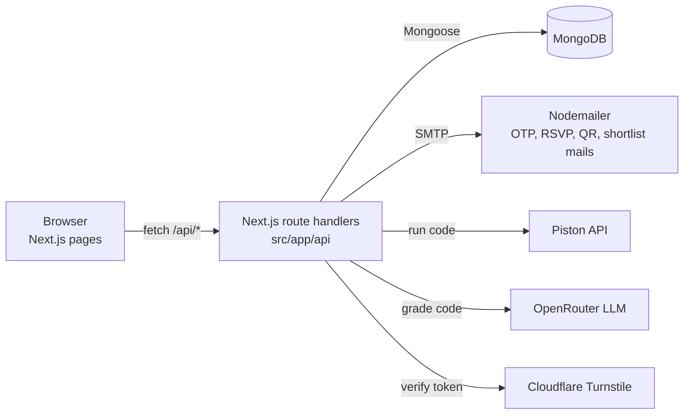

# Espionage — Event Platform

The registration and contest platform dBug Labs (SRM IST) built for **Espionage**, a two-round college coding event.
It handles the whole event: sign-up with email OTP, RSVP, QR attendance, a timed MCQ round, a shortlisted coding
round with a live code runner and AI-assisted grading, and an admin console to run it all.

**Stack:** Next.js 16 (App Router) · React 19 · TypeScript · Tailwind CSS 4 · MongoDB (Mongoose 9) · Nodemailer ·
Piston (code execution) · OpenRouter (LLM grading) · Cloudflare Turnstile · Vercel

## How the event flows

1. **Register** (`/register`): solo or duo. The participant verifies their email with a 6-digit OTP, passes
   Turnstile, and gets a participant ID like `ESP-042`.
2. **RSVP** (`/rsvp?token=…`): an admin sends RSVP emails; participants confirm their seat through a tokenised link.
3. **Attendance** (`/attendance`): volunteers scan each participant's QR code on the day, separately for round 1 and round 2.
4. **Login** (`/login`): email OTP. Only participants with a confirmed RSVP can log in.
5. **Round 1** (`/dashboard/round1`): timed MCQ test. Each participant gets the question bank in their own seeded
   random order. The test runs fullscreen with copy, paste, right-click and shortcut keys blocked; warnings and key violations
   are recorded.
6. **Shortlist**: the admin shortlists the top N by round 1 score; shortlisted participants are emailed.
7. **Round 2** (`/dashboard/round2`): coding round in a Monaco editor. *Run* checks the sample test case;
   *Submit* runs every hidden test case through Piston and records the verdict. Ending the round locks the final submissions.
8. **Evaluation**: the admin triggers grading. An accepted solution scores 100%; otherwise an LLM (via OpenRouter)
   scores the attempt with a rationale. The final score is weighted by each question's points.
9. **Results**: winners are marked and certificates are generated as PDFs.

## Architecture



One Next.js app serves both the pages and the API. There is no separate backend service.

## Folder map

| Path | What lives there |
|---|---|
| `src/app/*/page.tsx` | Pages: `/`, `/register`, `/rsvp`, `/login`, `/dashboard`, `/dashboard/round1`, `/dashboard/round2`, `/attendance`, `/admin`, `/oc`, `/success` |
| `src/app/api/` | API routes (table below) |
| `src/models/` | Mongoose models |
| `src/lib/mongodb.ts` | Cached database connection |
| `src/lib/mailer.ts` | All outgoing emails |
| `src/lib/piston.ts` | Code execution client with retries and runtime caching |
| `src/lib/round2.ts`, `round2Evaluation.ts`, `openrouter.ts` | Round 2 judging and AI grading |
| `src/lib/questionBank.ts` | Default MCQ and coding questions, seeded from the admin console |
| `src/lib/testSecurity.ts` | Fullscreen and keyboard lock for tests |
| `src/lib/captcha.ts`, `rate-limit.ts`, `accessControl.ts` | Turnstile check, in-memory rate limiting, env-flag kill switches |

## Data models

| Model | Purpose |
|---|---|
| `Participant` | The main record: identity, optional duo partner, RSVP, attendance per round, round 1 and round 2 scores, submissions, AI evaluations, warnings |
| `MCQQuestion` | Round 1 questions |
| `CodingQuestion` | Round 2 problems with sample and hidden test cases and starter code |
| `OTP` | One-time codes, auto-deleted by a TTL index |
| `EventConfig` | Single document of switches: `registrationOpen`, `round1Active`, `round2Active` |
| `Notification` | Announcements shown on the participant dashboard |
| `Organizer` | Organising committee members and their attendance (`/oc`) |
| `Team` | Earlier paid-team format (2–3 members); now used only for winners and certificates |

## API routes

| Area | Routes |
|---|---|
| Registration | `send-otp`, `verify-otp`, `register-manual`, `rsvp` |
| Participant auth | `auth/send-otp`, `auth/verify-otp` |
| Dashboard | `dashboard/me`, `dashboard/config`, `dashboard/notifications` |
| Round 1 | `round1/questions`, `round1/submit` |
| Round 2 | `round2/questions`, `round2/run` (sample case only), `round2/execute` (hidden cases, scored), `round2/submit` (ends the round, records warnings) |
| Attendance | `attendance`, `attendance/stats` |
| Admin | `admin/verify`, `event-config`, `questions`, `seed-mcq`, `seed-coding`, `seed-defaults`, `bulk-seed`, `send-rsvp`, `send-attendance-qr`, `shortlist`, `round2-evaluate`, `redo-round`, `teams`, `teams/[id]/winner`, `certificates`, `export`, `notifications`, `organizers`, `delete-participant` |

Admin routes check `ADMIN_PASSWORD`, sent in the request body or as a `Bearer` header.

## Run locally

Requires Node.js 20+ and a MongoDB database (local or Atlas).

```bash
npm install
cp .env.example .env.local   # fill in at least MONGODB_URI and ADMIN_PASSWORD
npm run dev                  # http://localhost:3000
```

Open `/admin`, log in with `ADMIN_PASSWORD`, and use **Seed defaults** to load the question bank.

- Without `TURNSTILE_SECRET_KEY`, captcha checks are skipped (development only).
- OTP, RSVP and QR emails need working `SMTP_*` values.
- Round 2 needs a reachable Piston endpoint, and AI grading needs `OPENROUTER_API_KEY`.

## Environment variables

See `.env.example`. Groups:

- **Database:** `MONGODB_URI`
- **Admin:** `ADMIN_PASSWORD`
- **Email:** `SMTP_HOST`, `SMTP_PORT`, `SMTP_USER`, `SMTP_PASS`
- **Code runner:** `PISTON_API_URL`, `PISTON_API_KEY`
- **AI grading:** `OPENROUTER_API_KEY`, `OPENROUTER_MODEL`
- **Captcha:** `TURNSTILE_SECRET_KEY`, `NEXT_PUBLIC_TURNSTILE_SITE_KEY`
- **Event details:** `EVENT_DATE`, `EVENT_TIME`, `EVENT_VENUE` and their `NEXT_PUBLIC_` versions, `NEXT_PUBLIC_SITE_URL`, `NEXT_PUBLIC_WHATSAPP_LINK`
- **Kill switches:** `LOGIN_PAUSED`, `OTP_ROUTES_PAUSED` and their `NEXT_PUBLIC_` versions

## Scripts

| Command | What it does |
|---|---|
| `npm run dev` | Development server |
| `npm run build` / `npm start` | Production build and serve |
| `npm run lint` | ESLint |
| `npm test` | Piston client tests (`src/lib/piston.test.ts`) |

---

Built by dBug Labs, SRM IST.
